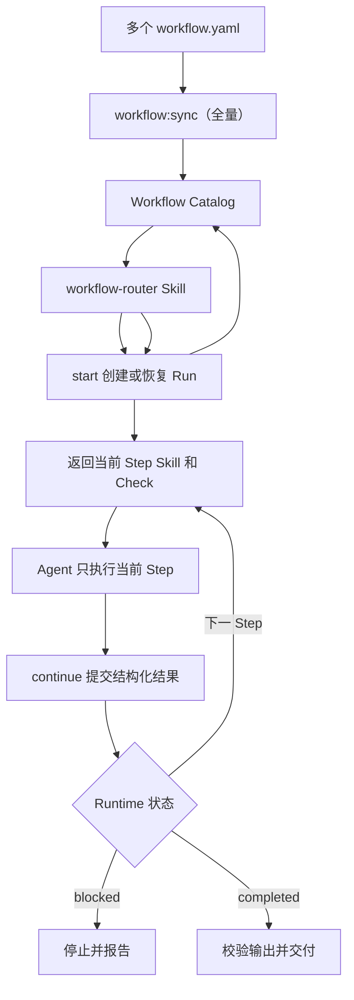

# Harness Next

Harness Next 使用一份标准 `workflow.yaml` 描述本地 Agent 应按什么顺序加载 Skill、执行任务，并在需要判断时接受 Check。项目采用 [Open Workflow Specification](https://github.com/open-workflow-specification/specification) 作为唯一 Workflow 格式。

## 全局怎么工作



贡献者只维护四类内容：

| 路径 | 内容 |
| --- | --- |
| `harness/workflows/` | Workflow、Step 和 Transition |
| `harness/models/` | 输入输出的 JSON Schema |
| `skills/` | Agent 完成 Step 的方法 |
| `harness/checks/` | Step 的验收规则 |

## 五个核心关键词

| 项目关键词 | Open Workflow 写法 | 含义 |
| --- | --- | --- |
| `Workflow` | 整个文档 | 完整流程 |
| `Step` | `do` 中的具名 Task | 一个执行或判断步骤 |
| `Transition` | 声明顺序、`then`、`switch` | 如何进入下一个 Step |
| `Skill` | 自定义 `call` | Agent 完成当前 Step 的方法 |
| `Check` | `metadata.harness.checks` | 需要质量判断或分支时使用的验收规则 |

业务输入和输出都是可选数据，不增加新的流程概念。

## Step 如何继续

- 固定顺序的 Skill Step 可以没有 `input`、`output` 和 Check；Skill 正常完成后视为 `passed`。
- Skill Step 下一节点是 `switch` 时必须绑定 Check，由 Check 提供明确状态。
- `passed` 继续，`needs_changes` 进入声明的回改 Step，`blocked` 停止并等待处理。
- 每次结果都应包含可核对的 `evidence`，业务 `data` 可选。

```yaml
status: passed | needs_changes | blocked
evidence:
  - 执行或判断依据
data: {}
```

## 当前支持范围

已经实现：

- YAML 和 JSON Workflow 解析；
- Open Workflow Specification `1.0.3` 标准校验；
- Workflow 输入输出 JSON Schema 校验；
- 无显式业务输入输出的 Skill Playbook；
- 顺序执行、`switch` 条件分支和通过 `then` 表达的回改 Cycle；
- Mermaid 流程图生成；
- 本地 SVG 图片生成；
- 不存在的 Skill、Check 和 Transition 检查；
- 不可达 Step 和无法到达结束节点的路径检查。
- 从 Workflow 元数据生成路由 Catalog；
- 本地 `start / continue / cancel` Runtime；
- `executionKey` 幂等恢复和单 Worktree 活动 Run 限制；
- Workflow Version、Source Hash 和 Step Revision 校验；
- Cycle 最大尝试次数；
- Check 结构化命令的本地执行和 Digest 证据；
- Run 完成时的 Workflow Output Schema 校验。
- npm、Yarn、pnpm 自动识别和 Node.js TypeScript 工程质量门禁；
- 工作区内 JSON Schema 通过 `harness://models/` 相互引用。

首版只接受两类 Task：

- 自定义 `call`：映射到本地 `skills/<call>/SKILL.md`；
- `switch`：只负责流程分支。

`schedule`、HTTP、gRPC、MCP、A2A、事件任务和其他远程执行能力会被拒绝。`for`、`fork`、`try` 等标准结构等本地执行语义明确后再开放。

Runtime 不调用外部 Agent，也不提供分布式调度。`workflow-router` 由当前本地 Agent 加载，并自动调用 Runtime、加载当前 Skill 和提交结果。

第一版没有 Codex、Claude Code 等宿主 Hook。Agent 或宿主完全重启后不保证主动恢复；重新加载 Router 后，Runtime 可以根据本地状态安全恢复。

## Agent 使用

正常使用只需要加载唯一入口：

```text
$workflow-router

请完成这个 Node.js TypeScript 变更……
```

Router 只读取 `harness/generated/workflow-catalog.json` 的 `entryWorkflows`，选择一个 Workflow，并自动执行 `workflow:start` 和 `workflow:continue`。用户不需要逐条运行内部命令。

### 使用 Node.js TypeScript 工作流

Node.js TypeScript 工作流适用于新增或修改功能、修复缺陷和重构代码。只解释代码或只做 Review 时不会选择该 Workflow。

在 Node.js TypeScript 项目的当前 Worktree 中加载 Router，并直接描述需要完成的变更：

```text
$workflow-router

请使用 node-typescript-development 工作流，修复配置加载失败的问题，并补充回归测试。
```

也可以使用 Alias `nodejs-development` 或 `typescript-development`。没有明确指定名称时，Router 会根据请求内容和 Catalog 中的适用、排除场景选择 Workflow；无法得到唯一候选时会停止并报告，不会自行猜测。

Router 选中 `harness/workflows/node-typescript-development/workflow.yaml` 后，会先完成其前置的 `node-typescript-standards` Workflow。该 Workflow 只有一个节点，负责将完整规范加载到当前 Agent 上下文；随后才进入开发流程：

| 阶段 | 执行内容 | 未通过时 |
| --- | --- | --- |
| 分析 | 阅读相关代码、约束和测试，明确目标、范围、风险及验证方式，不修改代码 | 分析信息不足时重新分析；缺少用户决定、权限或外部条件时停止 |
| 实现 | 按已通过的分析范围修改代码；行为变化先补失败测试，再完成最小实现 | 进入后续质量门禁 |
| 质量门禁 | 执行项目 Typecheck、Lint、Test、Build、变更文件规范检查和 `git diff --check` | 任一命令失败都会返回实现阶段修复 |
| Review | 基于需求、实际 Diff、测试和命令证据检查正确性、回归、兼容性与范围 | 发现可修复问题时返回实现阶段 |
| 交付 | 汇总变更、验证证据和剩余风险 | 输出不满足 Schema 时不会完成 Run |

每个 Step 最多尝试 3 次。执行过程中，Agent 每次只加载当前 Step 的 Skill、Check 和必要输入，Transition 完全由 Runtime 返回，用户不需要手工执行 `workflow:start` 或 `workflow:continue`。

Workflow 完成后输出以下结构：

```yaml
status: done
summary: 本次变更摘要
changedFiles:
  - src/example.ts
verification:
  - npm test 通过
risks: []
```

一个 Worktree 同时只能有一个 `running` Run。Agent 或宿主重启后，重新加载 `$workflow-router` 可以使用相同的 `executionKey` 恢复；如果 Runtime 返回 `interrupted`，Router 会先核对工作区和已有证据，再决定继续、返工或阻塞。

项目初始化和工程配置使用：

```text
harness/workflows/node-project-configuration/workflow.yaml
```

它用于初始化新的 Node.js TypeScript 项目，或规范化已有项目的 Node.js 版本、包管理器、Lockfile、TypeScript、ESLint、测试、构建、README 和 CI。业务功能开发仍由 `node-typescript-development` 处理。

Workflow 自动读取 `package.json#packageManager` 和项目根目录 Lockfile。新项目默认 npm；已有项目保留 npm、Yarn 或 pnpm。多个 Lockfile、声明冲突或无法判断时进入 `blocked`，不会自动删除文件或迁移包管理器。

Workflow Input 使用 `projectRoot` 指定目标项目目录，默认 `.`。Harness 的 Workflow、Skill、Check 和 Run 状态仍从 Harness 根目录加载；目标可以是另一个本地空目录或已有项目，但不能是远程仓库或远程执行目标。

## 本地开发

要求 Node.js 22 及以上版本。

```bash
npm install
npm run project:check
npm run check:all
npm run build
npm run doctor
npm run workflow:activate
npm run workflow:sync
npm run workflow:validate -- harness/workflows/node-typescript-standards/workflow.yaml
npm run workflow:validate -- harness/workflows/node-typescript-development/workflow.yaml
npm run workflow:validate -- harness/workflows/node-project-configuration/workflow.yaml
npm run workflow:diagram -- harness/workflows/node-typescript-standards/workflow.yaml
npm run workflow:image -- harness/workflows/node-typescript-standards/workflow.yaml
npm run workflow:image -- harness/workflows/node-typescript-development/workflow.yaml
npm run workflow:image -- harness/workflows/node-typescript-development/workflow.yaml --expand-prerequisites
npm run workflow:image -- harness/workflows/node-project-configuration/workflow.yaml
```

可运行示例包括 [node-typescript-standards/workflow.yaml](./harness/workflows/node-typescript-standards/workflow.yaml)、[node-typescript-development/workflow.yaml](./harness/workflows/node-typescript-development/workflow.yaml) 和 [node-project-configuration/workflow.yaml](./harness/workflows/node-project-configuration/workflow.yaml)。

## Workflow 激活范围

[workflow-activation.yaml](./harness/workflow-activation.yaml) 是人工维护的 Router 入口声明。每一项是仓库相对的入口 `workflow.yaml` 路径：

```yaml
version: 1
entryWorkflowPaths:
  - harness/workflows/node-typescript-development/workflow.yaml
  - harness/workflows/node-project-configuration/workflow.yaml
```

执行以下命令会读取该文件，将声明入口和它们的递归前置依赖写入同一份 `harness/generated/workflow-catalog.json`：

```bash
npm run workflow:activate
```

前置 Workflow 会保留在 Catalog 中供执行期解析，但不是 Router 候选入口。`npm run workflow:sync` 仍可由全部 Workflow 覆盖生成同一个 Catalog；最后执行的命令决定当前 Router 的候选范围。

## Node.js 项目质量门禁

`project-check` 是包管理器无关的本地检查入口：

```bash
npm run project:check
```

也可以从 Harness 根目录直接检查另一个本地项目：

```bash
npm run project:check -- ../path/to/project
```

它先检查 `packageManager`、唯一 Lockfile、`tsconfig.json`、ESLint、README、`.gitignore`、CI、Node.js 版本和标准 scripts，再使用识别出的 npm、Yarn 或 pnpm 依次执行 `typecheck`、`lint`、`test` 和 `build`。完整命令输出不会写入 Run 状态，Runtime 只保存退出码、耗时和 Digest。

`harness/workflows/node-typescript-standards/STANDARDS.md` 是 Node.js TypeScript 开发规范的唯一来源，包含模型读取的开发约束，以及质量门禁读取的结构化阈值。质量门禁只检查本次变更的生产 TypeScript 文件，避免历史技术债阻断无关改动；改动任一生产文件后，该文件必须符合全部阈值。

项目配置请求示例：

```json
{
  "request": "初始化一个 Node.js TypeScript CLI 项目",
  "projectRoot": "../my-cli",
  "constraints": []
}
```

## Runtime 调试

下面的命令主要供 Router 和 Runtime 开发调试使用：

```bash
npm run workflow:start -- <workflow.yaml> <execution-key> <input.json>
npm run workflow:continue -- <run-id> [step-result.json]
npm run workflow:cancel -- <run-id> <reason>
```

命令 stdout 输出 JSON。`.harness/runs/<run-id>/state.json` 保存本地状态并被 Git 忽略，不得写入 Secret 和完整 Prompt。

## 生成图片

`workflow:image` 根据 Workflow 编译得到的同一份有向图生成本地 SVG，不需要浏览器、远程服务或图片上传。

```bash
npm run workflow:image -- harness/workflows/node-typescript-standards/workflow.yaml
```

默认输出：

```text
harness/generated/node-typescript-standards.svg
```

也可以指定当前工作区内的输出路径：

```bash
npm run workflow:image -- harness/workflows/node-typescript-standards/workflow.yaml docs/node-typescript-standards.svg
```

Mermaid 和 SVG 都是展示结果，唯一事实源仍然是 `workflow.yaml`。

当 Workflow 声明 `metadata.harness.prerequisites` 时，可添加 `--expand-prerequisites` 展开其全部前置 Workflow 和 `prerequisite` 依赖边：

```bash
npm run workflow:diagram -- harness/workflows/node-typescript-development/workflow.yaml --expand-prerequisites
npm run workflow:image -- harness/workflows/node-typescript-development/workflow.yaml --expand-prerequisites
```

展开图片默认输出为 `harness/generated/node-typescript-development-expanded.svg`；指定输出路径时，标志可位于路径前后。

## 依赖说明

项目精确锁定 `@openworkflowspec/sdk@1.0.3-alpha4`。该版本目前仍为 `alpha`，所有 SDK 调用都收口在 `compileWorkflow()` 后面，后续升级不应影响 Workflow 贡献者。
