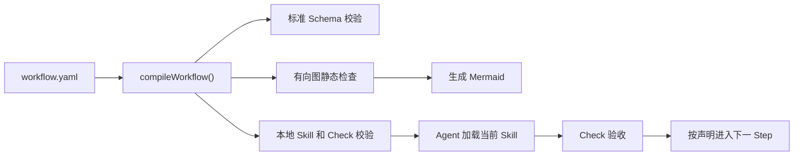

# Harness Next

Harness Next 使用一份标准 `workflow.yaml` 描述本地 Agent 应按什么顺序加载 Skill、执行任务和接受 Check。项目采用 [Open Workflow Specification](https://github.com/open-workflow-specification/specification) 作为唯一 Workflow 格式，不再维护自定义 DSL。

## 全局怎么工作



贡献者只维护四类内容：

| 路径 | 内容 |
| --- | --- |
| `harness/workflows/` | Workflow、Step 和 Transition |
| `harness/models/` | 输入输出的 JSON Schema |
| `skills/` | Agent 完成 Step 的方法 |
| `harness/checks/` | Step 的验收规则 |

## 五个核心关键词

| 项目关键词 | Open Workflow 写法 | 含义 |
| --- | --- | --- |
| `Workflow` | 整个文档 | 完整流程 |
| `Step` | `do` 中的具名 Task | 一个执行或判断步骤 |
| `Transition` | 声明顺序、`then`、`switch` | 如何进入下一个 Step |
| `Skill` | 自定义 `call` | Agent 完成当前 Step 的方法 |
| `Check` | `metadata.harness.checks` | 当前 Step 的验收规则 |

输入输出是 Workflow 传递的数据，不增加新的流程概念。

## 当前支持范围

已经实现：

- YAML 和 JSON Workflow 解析；
- Open Workflow Specification `1.0.3` 标准校验；
- Workflow 输入输出 JSON Schema 校验；
- 顺序执行、`switch` 条件分支和通过 `then` 表达的回改 Cycle；
- Mermaid 流程图生成；
- 本地 SVG 图片生成；
- 不存在的 Skill、Check 和 Transition 检查；
- 不可达 Step 和无法到达结束节点的路径检查。

首版只接受两类 Task：

- 自定义 `call`：映射到本地 `skills/<call>/SKILL.md`；
- `switch`：只负责流程分支。

`schedule`、HTTP、gRPC、MCP、A2A、事件任务和其他远程执行能力会被拒绝。`for`、`fork`、`try` 等标准结构等本地执行语义明确后再开放。

当前实现完成的是 Workflow 编译和静态检查层，不负责主动调用 Agent 或执行 Skill。

## 本地开发

要求 Node.js 22 及以上版本。

```bash
npm install
npm run check:all
npm run build
npm run doctor
npm run workflow:validate -- harness/workflows/feature-development/workflow.yaml
npm run workflow:diagram -- harness/workflows/feature-development/workflow.yaml
npm run workflow:image -- harness/workflows/feature-development/workflow.yaml
```

可运行示例位于 [feature-development/workflow.yaml](./harness/workflows/feature-development/workflow.yaml)。

## 生成图片

`workflow:image` 根据 Workflow 编译得到的同一份有向图生成本地 SVG，不需要浏览器、远程服务或图片上传。

```bash
npm run workflow:image -- harness/workflows/feature-development/workflow.yaml
```

默认输出：

```text
harness/generated/feature-development.svg
```

也可以指定当前工作区内的输出路径：

```bash
npm run workflow:image -- harness/workflows/feature-development/workflow.yaml docs/feature-development.svg
```

Mermaid 和 SVG 都是展示结果，唯一事实源仍然是 `workflow.yaml`。

## 依赖说明

项目精确锁定 `@openworkflowspec/sdk@1.0.3-alpha4`。该版本目前仍为 `alpha`，所有 SDK 调用都收口在 `compileWorkflow()` 后面，后续升级不应影响 Workflow 贡献者。
