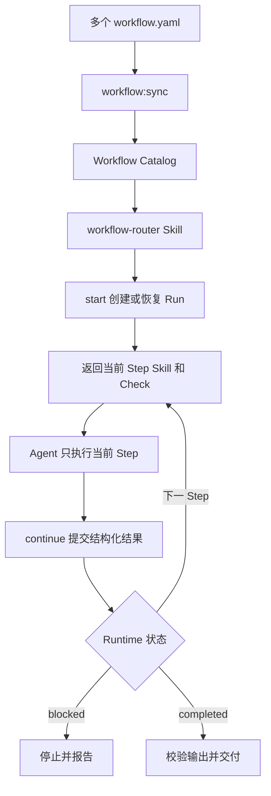

# Harness Next

Harness Next 使用一份标准 `workflow.yaml` 描述本地 Agent 应按什么顺序加载 Skill、执行任务，并在需要判断时接受 Check。项目采用 [Open Workflow Specification](https://github.com/open-workflow-specification/specification) 作为唯一 Workflow 格式，不再维护自定义 DSL。

## 全局怎么工作



贡献者只维护四类内容：

| 路径 | 内容 |
| --- | --- |
| `harness/workflows/` | Workflow、Step 和 Transition |
| `harness/models/` | 输入输出的 JSON Schema |
| `skills/` | Agent 完成 Step 的方法 |
| `harness/checks/` | Step 的验收规则 |

## 五个核心关键词

| 项目关键词 | Open Workflow 写法 | 含义 |
| --- | --- | --- |
| `Workflow` | 整个文档 | 完整流程 |
| `Step` | `do` 中的具名 Task | 一个执行或判断步骤 |
| `Transition` | 声明顺序、`then`、`switch` | 如何进入下一个 Step |
| `Skill` | 自定义 `call` | Agent 完成当前 Step 的方法 |
| `Check` | `metadata.harness.checks` | 需要质量判断或分支时使用的验收规则 |

业务输入和输出都是可选数据，不增加新的流程概念。

## Step 如何继续

- 固定顺序的 Skill Step 可以没有 `input`、`output` 和 Check；Skill 正常完成后视为 `passed`。
- Skill Step 下一节点是 `switch` 时必须绑定 Check，由 Check 提供明确状态。
- `passed` 继续，`needs_changes` 进入声明的回改 Step，`blocked` 停止并等待处理。
- 每次结果都应包含可核对的 `evidence`，业务 `data` 可选。

```yaml
status: passed | needs_changes | blocked
evidence:
  - 执行或判断依据
data: {}
```

## 当前支持范围

已经实现：

- YAML 和 JSON Workflow 解析；
- Open Workflow Specification `1.0.3` 标准校验；
- Workflow 输入输出 JSON Schema 校验；
- 无显式业务输入输出的 Skill Playbook；
- 顺序执行、`switch` 条件分支和通过 `then` 表达的回改 Cycle；
- Mermaid 流程图生成；
- 本地 SVG 图片生成；
- 不存在的 Skill、Check 和 Transition 检查；
- 不可达 Step 和无法到达结束节点的路径检查。
- 从 Workflow 元数据生成路由 Catalog；
- 本地 `start / continue / cancel` Runtime；
- `executionKey` 幂等恢复和单 Worktree 活动 Run 限制；
- Workflow Version、Source Hash 和 Step Revision 校验；
- Cycle 最大尝试次数；
- Check 结构化命令的本地执行和 Digest 证据；
- Run 完成时的 Workflow Output Schema 校验。

首版只接受两类 Task：

- 自定义 `call`：映射到本地 `skills/<call>/SKILL.md`；
- `switch`：只负责流程分支。

`schedule`、HTTP、gRPC、MCP、A2A、事件任务和其他远程执行能力会被拒绝。`for`、`fork`、`try` 等标准结构等本地执行语义明确后再开放。

Runtime 不调用外部 Agent，也不提供分布式调度。`workflow-router` 由当前本地 Agent 加载，并自动调用 Runtime、加载当前 Skill 和提交结果。

第一版没有 Codex、Claude Code 等宿主 Hook。Agent 或宿主完全重启后不保证主动恢复；重新加载 Router 后，Runtime 可以根据本地状态安全恢复。

## Agent 使用

正常使用只需要加载唯一入口：

```text
$workflow-router

请完成这个 Node.js TypeScript 变更……
```

Router 只读取 `harness/generated/workflow-catalog.json`，选择一个 Workflow，并自动执行 `workflow:start` 和 `workflow:continue`。用户不需要逐条运行内部命令。

当前 Node.js 开发流程位于：

```text
harness/workflows/node-typescript-development/workflow.yaml
```

它依次执行分析、实现、质量门禁、Review 和交付；分析、质量或 Review 不通过时返回对应修改 Step。

## 本地开发

要求 Node.js 22 及以上版本。

```bash
npm install
npm run check:all
npm run build
npm run doctor
npm run workflow:sync
npm run workflow:validate -- harness/workflows/feature-development/workflow.yaml
npm run workflow:validate -- harness/workflows/node-typescript-development/workflow.yaml
npm run workflow:diagram -- harness/workflows/feature-development/workflow.yaml
npm run workflow:image -- harness/workflows/node-typescript-development/workflow.yaml
```

可运行示例包括 [feature-development/workflow.yaml](./harness/workflows/feature-development/workflow.yaml) 和 [node-typescript-development/workflow.yaml](./harness/workflows/node-typescript-development/workflow.yaml)。

## Runtime 调试

下面的命令主要供 Router 和 Runtime 开发调试使用：

```bash
npm run workflow:start -- <workflow.yaml> <execution-key> <input.json>
npm run workflow:continue -- <run-id> [step-result.json]
npm run workflow:cancel -- <run-id> <reason>
```

命令 stdout 输出 JSON。`.harness/runs/<run-id>/state.json` 保存本地状态并被 Git 忽略，不得写入 Secret 和完整 Prompt。

## 生成图片

`workflow:image` 根据 Workflow 编译得到的同一份有向图生成本地 SVG，不需要浏览器、远程服务或图片上传。

```bash
npm run workflow:image -- harness/workflows/feature-development/workflow.yaml
```

默认输出：

```text
harness/generated/feature-development.svg
```

也可以指定当前工作区内的输出路径：

```bash
npm run workflow:image -- harness/workflows/feature-development/workflow.yaml docs/feature-development.svg
```

Mermaid 和 SVG 都是展示结果，唯一事实源仍然是 `workflow.yaml`。

## 依赖说明

项目精确锁定 `@openworkflowspec/sdk@1.0.3-alpha4`。该版本目前仍为 `alpha`，所有 SDK 调用都收口在 `compileWorkflow()` 后面，后续升级不应影响 Workflow 贡献者。
