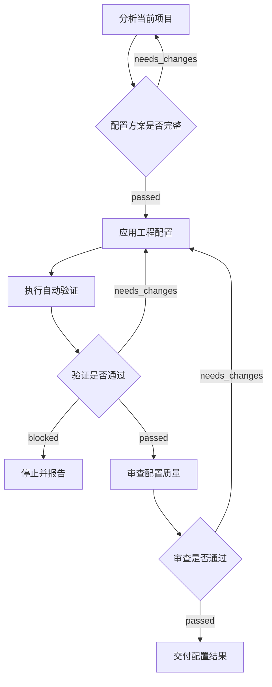

# Node.js TypeScript 项目配置 Workflow 设计

## 目标

新增 `node-project-configuration` Workflow，使本地 Agent 能对 `projectRoot` 指向的本地目录完成两类任务：

- 初始化新的 Node.js TypeScript 项目；
- 检查并规范化已有 Node.js TypeScript 项目。

完成后的项目必须能够使用确定的包管理器安装依赖，并通过 Typecheck、Lint、Test 和 Build。Workflow 不负责业务功能开发。

## 执行范围

Workflow Input 使用 `projectRoot` 指定本地目标目录，默认 `.`。Harness Root 继续保存 Workflow、Skill、Check、Catalog 和 Run 状态，Workspace Root 是 Run 固化的目标项目目录。Workflow 不接受远程仓库或网络执行目标，不增加第二套 Runtime。

- 不存在 `package.json` 时按新项目处理，默认 npm。
- 存在 `package.json` 时按已有项目处理，保留现有 npm、Yarn 或 pnpm。
- 包管理器、模块系统和测试框架迁移必须由用户明确同意。
- Docker、数据库、日志和健康检查只在用户需求或已有项目结构需要时处理。

## Workflow



执行 Skill：

1. `analyze-node-project`：检查项目现状并生成目标 Profile 和修改计划。
2. `configure-node-project`：根据已通过的计划创建或修改工程配置。
3. `verify-node-project`：准备确定性验证，不自行伪造命令结果。
4. `review-node-project-configuration`：审查一致性、安全性、范围和维护成本。
5. `deliver-node-project-configuration`：生成符合 Schema 的最终结果。

## 核心实体

`NodeProjectProfile` 是 Workflow 数据，不是新的流程概念：

```text
NodeProjectProfile
├── projectState: new | existing
├── projectKind: service | cli | library
├── nodeVersion
├── packageManager
│   ├── name: npm | yarn | pnpm
│   ├── version
│   └── detectedBy[]
├── moduleSystem: esm | commonjs
├── source
│   ├── sourceDir
│   ├── testDir
│   ├── entrypoints[]
│   └── outputDir
├── scripts
│   ├── dev
│   ├── typecheck
│   ├── lint
│   ├── test
│   ├── build
│   ├── start（可选）
│   └── checkAll
├── quality
│   ├── strictTypeScript
│   ├── noExplicitAny
│   ├── testRunner
│   └── dependencyCheck（可选）
├── configuration
│   ├── environments[]
│   ├── configSource
│   ├── validationEntry
│   └── secretPolicy
└── optionalCapabilities[]
```

新项目默认使用 Node.js 24、npm、ESM、strict TypeScript、`src/`、`test/` 和标准 scripts。已有项目保留现有模块系统、目录、包管理器和测试框架，只补缺失能力或修复有证据的冲突。

新项目的工具版本、目录、scripts、TypeScript、ESLint 和 CI 默认值固定在 `skills/configure-node-project/BASELINE.md`。Workflow Version 不变时不应随 Agent 或执行日期漂移；偏离基线必须来自用户约束或项目类型，并记录原因。

## 包管理器识别

识别顺序固定：

1. 读取根目录 `package.json#packageManager`；
2. 检查根目录 `package-lock.json`、`npm-shrinkwrap.json`、`yarn.lock`、`pnpm-lock.yaml`；
3. 新项目没有任何信号时默认 npm；
4. 已有项目没有任何信号时返回 `unknown`；
5. 多个 Lockfile 或声明与 Lockfile 不一致时返回 `conflict`。

只检查项目根目录，忽略 `node_modules/.package-lock.json`。README、CI 和 scripts 只能作为辅助证据，不能覆盖声明和 Lockfile。

## 自动质量门禁

新增内部 `project-check` CLI。Check 使用 `node dist/cli.js project-check`，不写死 npm、Yarn 或 pnpm。

确定性 Check 可以声明 `cwd: harness | workspace`。`project-check` 在 Harness Root 启动并读取 Runtime 提供的 Workspace Root；`git diff --check` 在目标 Workspace 执行。

`project-check`：

- 复用同一个包管理器识别 Module；
- 检查 `package.json`、唯一 Lockfile、`tsconfig.json`、ESLint 配置、`.gitignore`、README 和 CI；
- 检查标准 scripts：`typecheck`、`lint`、`test`、`build`、`check:all`；
- 检查 `package.json#engines.node`、`.nvmrc`、Docker 和 CI 中可识别的 Node.js Major 是否冲突；
- 使用识别出的包管理器依次执行 `typecheck`、`lint`、`test` 和 `build`；
- 返回结构化结果和非零退出码，完整命令输出仍由 Runtime 只保存 Digest。

`node-typescript-development` 的现有质量门禁也改用该入口，避免 Yarn 和 pnpm 项目被写死的 npm 命令阻断。

## Check

- `node-project-plan-ready`：Profile、现状证据、修改范围、保留决定和验证方案完整时通过。
- `node-project-quality-gate`：执行 `project-check` 与 `git diff --check`。
- `node-project-review-result`：实际 Diff 与 Profile 一致、没有静默迁移和 Secret、文档与命令一致时通过。

配置或代码缺陷返回 `needs_changes`；缺少工具、权限或必须由用户决定的冲突返回 `blocked`。

## 路由边界

`node-project-configuration` 用于初始化、工程配置补齐、Node.js 版本统一、Lockfile 冲突、scripts、TypeScript、Lint、测试、构建、README、Docker 或 CI 一致性问题。

`node-typescript-development` 继续用于业务功能、缺陷修复和代码重构。一个请求同时包含工程初始化和业务功能时，先完成项目配置 Run，再启动业务开发 Run。

## 安全约束

- 不读取后输出 Secret 值，不把 Secret 写入 Workflow 状态。
- 不自动删除冲突 Lockfile、已有 scripts 或看起来有意保留的配置。
- 不自动迁移包管理器、模块系统或测试框架。
- 不访问远程执行目标，不上传源码、配置、图片、Prompt 或经验数据。

## 验收矩阵

至少覆盖：

- 空目录识别为新项目并默认 npm；
- npm、Yarn、pnpm 项目正确识别；
- `packageManager` 与 Lockfile 冲突；
- 多 Lockfile 冲突；
- 已有项目无包管理器证据；
- 标准 scripts 缺失；
- 四个质量命令按正确包管理器执行；
- 任一命令失败时 CLI 非零退出；
- 新 Workflow 可编译、可生成 Catalog 和 SVG；
- 现有 Node.js 开发 Workflow 复用相同质量门禁；
- 当前 Harness Next 仓库通过新的 `project-check`、`check:all` 和全部 Workflow 校验。
